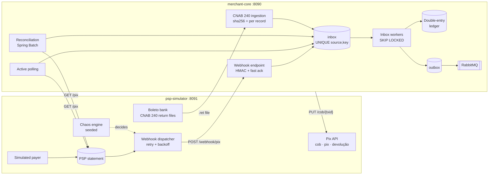

# PixLab

**A lab that proves every cent of a Pix or boleto payment is credited exactly once — under duplicated, delayed, reordered, lost and forged notifications.**

[Leia em português](README.pt-BR.md) · [Design doc](docs/design.md) · [ADRs](docs/adr/) · [Roadmap](docs/roadmap.md) · [Load test](docs/load-test.md)


Payment providers (PSPs) notify merchants asynchronously, and in production those notifications arrive twice, late, out of order, or never. PixLab pairs a **fake PSP with a deterministic chaos engine** with a **reference merchant** that shows how to do it right: idempotent ingestion, a pure state machine, a double-entry ledger and automated reconciliation. Every failure mode is a reproducible test.

## Architecture



There is **one way in**: webhooks, active polling, reconciliation repairs and CNAB records all go through the same inbox, guarded by a database `UNIQUE` constraint. That single path is why the guarantees hold everywhere.

## Chaos scenario → how it is handled

| Scenario | What happens | How PixLab handles it | Proof |
|---|---|---|---|
| `PIX-DUP` | Same webhook delivered N times | `INSERT … ON CONFLICT DO NOTHING` on `UNIQUE(source, event_key)` | 20 sequential redeliveries → 1 credit |
| `PIX-DUP-CONC` | Duplicates **at the same time** | Same constraint; no read-then-write race | 1,000 concurrent deliveries → exactly 1 credit |
| `PIX-DELAY` | Delivered seconds to hours later | State doesn't depend on timing; virtual clock makes hours take ms | E2E with 2h delays |
| `PIX-LOST` | Webhook never arrives | Active polling re-reads the PSP statement through the inbox | E2E + property test |
| `PIX-RETRY` | Ack lost; PSP retries with backoff | Fast ack, idempotent reprocessing | Dispatcher tests |
| `PIX-UNKNOWN` | Pix for a `txid` that isn't ours | Booked to suspense with an alert — never silently dropped ([ADR-0006](docs/adr/0006-hmac-e-pix-sem-cobranca.md)) | Reconciliation: `SEM_COBRANCA` |
| `PIX-AMOUNT` | Webhook amount ≠ statement | Reconciliation adjusts the ledger to the PSP and opens a case ([ADR-0007](docs/adr/0007-conciliacao-ajusta-para-o-psp.md)) | Invariant 4 closes to the cent |
| `PIX-BAD-AUTH` | Forged webhook | HMAC-SHA256 checked in constant time; `401` before any effect | Forged deliveries in every mixed run |
| `PIX-OOO` | Refund notified before the credit | Event retried with backoff until the credit arrives | E2E + 300-run property test |
| `PIX-REFUND-PARTIAL` | Several partial refunds | Payment row locked; Σ refunds ≤ amount | 25 concurrent refunds respect the limit |
| `PIX-REFUND-FAIL` | Refund ends `NAO_REALIZADO` | Provisional entry reversed | E2E |
| `PIX-MED` | Payer-initiated refund (fraud) | Booked on arrival with an alert | E2E |
| `BOL-OVER` / `BOL-UNDER` | Boleto paid above/below due | Explicit policy ([ADR-0008](docs/adr/0008-politica-de-valores-do-boleto.md)): excess → refundable credit; short → suspense | Scenario tests |
| `BOL-DOUBLE` | Same boleto paid twice | Second payment → refundable credit | Scenario + E2E |
| `BOL-LATE` | Paid after due date | Expected amount recomputed with fine + daily interest | Scenario + E2E |
| `BOL-FILE-DUP` | Same return file processed again | sha256 per file **and** key per record | Same file 10× → ledger unchanged |
| `BOL-FILE-CORRUPT` | Invalid CNAB line mid-file | Only the broken T+U pair is dropped; a corrected file recovers it | Scenario + E2E |

## Invariants, checked after any combination of chaos

1. **Uniqueness** — each `endToEndId` produces at most one credit.
2. **Double entry** — for every transaction, Σ debits = Σ credits.
3. **Bounded refunds** — Σ refunds of a payment ≤ its amount.
4. **Closing** — after reconciliation, Σ `psp:pix:liquidar` = Σ PSP statement for the window.
5. **Nothing gets stuck** — every inbox event ends `PROCESSED` or `QUARANTINED`.

Invariants 1, 2 and 5 hold across **500 jqwik runs** of random delivery chaos; invariant 3 across **300 runs** of random refund orderings; invariant 4 in every end-to-end chaos run.

## Reproducible chaos

Every decision is derived from `seed + endToEndId + scenario`, so a failure prints its seed and replays exactly:

```bash
./gradlew chaos --chaos-profile=mixed --seed=42 --payments=40
```

Profiles live in [`chaos-profiles/`](chaos-profiles/).

## Bugs the chaos engine found

Building this surfaced real bugs, now covered by tests:

- **Deadlocked dispatcher.** It held `FOR UPDATE` row locks while worker threads tried to update the same rows over other connections. Fixed with a short lease (`SENDING` + expiry) and no transaction around HTTP.
- **Overwritten statement entries.** Re-applying the same seed within a minute regenerated an `endToEndId`, and JPA's `save()` *merged* over the old Pix instead of failing. Fixed with strict inserts (`Persistable.isNew`) and collision skipping; the same issue hit refund `rtrId`s.
- **Ledger references colliding across payments.** A refund `id` is only unique within its Pix (per the Pix API). Ledger references are now `e2eId:id`.

## Observability

`docker compose --profile observability up -d` starts Prometheus, Grafana (http://localhost:3001) and Jaeger (http://localhost:16686).

- Domain metrics: `webhook_received_total`, `webhook_duplicate_discarded_total`, `webhook_rejected_total`, `inbox_lag_seconds`, `inbox_events`, `ledger_imbalance` (always 0), `recon_divergence_total`, `psp_chaos_injections_total`…
- **One trace from payment to ledger.** The W3C `traceparent` is stored with each queued webhook delivery and inbox event, so a single trace follows the simulated payment → dispatcher thread → HTTP → merchant inbox worker → ledger post.
- Load test (k6): **500 req/s with 30% redeliveries, p99 16.5 ms, zero errors, inbox lag ≤ 0.4 s, ledger balanced.** See [docs/load-test.md](docs/load-test.md).

## Run it

Requirements: JDK 25 and Docker.

```bash
docker compose up -d                       # 2× PostgreSQL + RabbitMQ
./gradlew :psp-simulator:bootRun           # http://localhost:8091
./gradlew :merchant-core:bootRun           # http://localhost:8090
./scripts/demo.sh                          # the demo above
./gradlew build                            # 127 tests: unit, property, integration, E2E
```

Ports can be overridden with `MERCHANT_PORT`, `PSP_PORT`, `MERCHANT_DB_PORT`, `PSP_DB_PORT`.

## Stack

Java 25 · Spring Boot 4.1 · Spring Batch 6 · PostgreSQL 16 · RabbitMQ 4 · Flyway · Testcontainers · jqwik · Micrometer · OpenTelemetry · Prometheus · Grafana · Jaeger · k6 · GitHub Actions

| Module | Role |
|---|---|
| `psp-simulator` | Fake PSP inspired by the Brazilian Central Bank Pix API, plus a boleto bank emitting CNAB 240 return files |
| `merchant-core` | Reference receiver: inbox, state machine, ledger, outbox, active polling, reconciliation |
| `shared-contracts` | Payload DTOs, boleto barcode/digitable line (mod 10/11) and the CNAB 240 codec |
| `e2e-tests` | Both services as real processes, end to end |

## License

MIT
