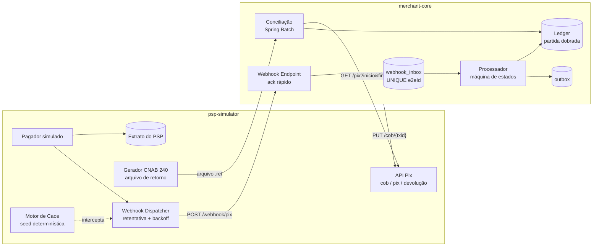
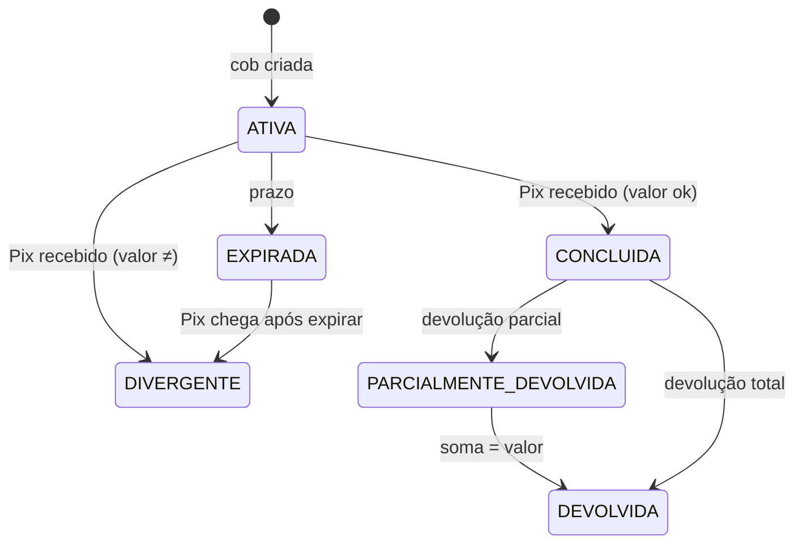

# PixLab — Design Doc

| | |
|---|---|
| **Autor** | Rodrigo Scharp |
| **Status** | v1.0 — implementado (F0–F8) |
| **Data** | 2026-10-06 |
| **Roadmap** | [roadmap.md](roadmap.md) |
| **Decisões** | [adr/](adr/) |

---

## 1. Contexto

Todo sistema que recebe dinheiro via Pix ou boleto depende de **notificações assíncronas de um PSP** (Provedor de Serviços de Pagamento). Em produção, essas notificações:

- chegam **duplicadas** (o PSP reenvia quando não recebe 2xx a tempo);
- chegam **atrasadas** ou **fora de ordem** (devolução antes do crédito);
- às vezes **nunca chegam**;
- podem trazer **dados divergentes** do que foi cobrado (valor pago a maior/menor no boleto).

O sistema recebedor precisa garantir que **cada centavo seja creditado exatamente uma vez** e que, no fim do dia, o saldo interno **bata com o extrato do PSP**. Isso é o que bancos e fintechs chamam de *idempotência* e *conciliação* — e é onde a maioria dos bugs financeiros mora.

## 2. Objetivo

Construir um **laboratório reproduzível** com duas peças:

1. **`psp-simulator`** — um PSP falso que fala o "dialeto" da API Pix do Banco Central e gera arquivos de retorno de boleto (CNAB 240), com um **motor de caos** configurável que injeta falhas de forma determinística.
2. **`merchant-core`** — um sistema recebedor de referência que mostra **como fazer certo**: ingestão idempotente, máquina de estados da cobrança, ledger de partida dobrada e conciliação automática.

O laboratório é bem-sucedido quando qualquer cenário de caos pode ser rodado com uma *seed*, e os **invariantes financeiros** (seção 9) continuam verdadeiros.

### 2.1 Não-objetivos

- Não é um PSP real nem se conecta ao SPI/DICT.
- Não implementa Pix Automático, Pix Saque/Troco ou Open Finance.
- Não substitui a validação contra a especificação oficial; os payloads são **inspirados** na API Pix do BCB e devem ser conferidos contra [bacen/pix-api](https://github.com/bacen/pix-api).
- Sem front-end elaborado: um console simples basta.

## 3. Visão geral



**Fluxo feliz (Pix):**

1. `merchant-core` cria uma cobrança imediata (`PUT /cob/{txid}`) → status `ATIVA`.
2. O pagador simulado paga; o simulador gera um `endToEndId` e registra no extrato.
3. O dispatcher envia `POST {webhookUrl}/pix` com o lote de Pix recebidos.
4. `merchant-core` grava o evento na inbox e responde `200` imediatamente.
5. O processador consome a inbox, transiciona a cobrança para `CONCLUIDA` e lança no ledger.
6. A conciliação, periódica, compara ledger × extrato do PSP e abre divergências.

## 4. Domínio

### 4.1 Pix (inspirado na API Pix do BCB)

| Conceito | Descrição | Regra no PixLab |
|---|---|---|
| `txid` | Identificador da cobrança, definido pelo recebedor | `[a-zA-Z0-9]{26,35}` |
| `endToEndId` (e2eId) | Identificador único da transação no SPI | 32 caracteres: `E` + ISPB (8) + `yyyyMMddHHmm` + 11 alfanuméricos |
| `cob` | Cobrança imediata | Status: `ATIVA`, `CONCLUIDA`, `REMOVIDA_PELO_USUARIO_RECEBEDOR`, `REMOVIDA_PELO_PSP` |
| Devolução | Estorno total ou parcial de um Pix recebido | `PUT /pix/{e2eId}/devolucao/{id}`; status `EM_PROCESSAMENTO`, `DEVOLVIDO`, `NAO_REALIZADO`; soma ≤ valor original |
| MED | Mecanismo Especial de Devolução (fraude/falha operacional), iniciado pelo lado pagador | Simulado como devolução não solicitada pelo recebedor |
| Webhook | Notificação de Pix recebido | Corpo `{"pix":[{endToEndId, txid, valor, horario, infoPagador, devolucoes[]}]}`; autenticação mTLS no mundo real |

Exemplo de payload emitido pelo simulador:

```json
{
  "pix": [
    {
      "endToEndId": "E12345678202610061530abcdefghijk",
      "txid": "pixlab7f3c9a1b2d4e5f60718293a4",
      "valor": "150.00",
      "horario": "2026-10-06T15:30:12.358Z",
      "infoPagador": "Pedido #4821",
      "devolucoes": []
    }
  ]
}
```

### 4.2 Boleto

| Conceito | Regra no PixLab |
|---|---|
| Nosso número | Identificador do título no banco emissor; chave de conciliação |
| Código de barras / linha digitável | 44 / 47 dígitos, com dígitos verificadores calculados (módulo 10 e 11) |
| Liquidação | Ocorre em D+0; crédito ao beneficiário em D+1 (configurável) |
| Arquivo de retorno | CNAB 240 (Febraban), segmentos **T** (título) e **U** (valores pagos, datas) |
| Ocorrências | `02` entrada confirmada, `06` liquidação, `09` baixa |
| Divergências possíveis | Pago a maior, a menor, após vencimento (juros/multa), pago duas vezes |

## 5. Catálogo de cenários de caos

Cada cenário tem um código, é ativado por configuração e é **determinístico dado uma seed**.

| Código | Cenário | O que o consumidor precisa provar |
|---|---|---|
| `PIX-DUP` | Mesmo webhook entregue N vezes | Crédito único por e2eId |
| `PIX-DUP-CONC` | Duplicatas **simultâneas** (corrida) | Idempotência sob concorrência, não só sequencial |
| `PIX-DELAY` | Entrega com atraso de segundos a horas | Estado correto independentemente do tempo |
| `PIX-LOST` | Webhook nunca entregue | Conciliação detecta e repara via consulta ativa |
| `PIX-OOO` | Devolução notificada antes do crédito | Tratamento de eventos fora de ordem |
| `PIX-RETRY` | Consumidor responde 5xx/timeout → PSP reenvia com backoff | Ack rápido; reprocessamento seguro |
| `PIX-UNKNOWN` | Webhook para `txid` inexistente | Suspense com alerta, sem crédito silencioso ([ADR-0006](adr/0006-hmac-e-pix-sem-cobranca.md)) |
| `PIX-AMOUNT` | Valor do webhook ≠ valor no extrato | Divergência aberta pela conciliação |
| `PIX-REFUND-PARTIAL` | Várias devoluções parciais | Soma de devoluções ≤ valor original |
| `PIX-REFUND-FAIL` | Devolução termina `NAO_REALIZADO` | Reversão do lançamento provisório |
| `PIX-MED` | Devolução via MED não solicitada | Débito e alerta sem quebrar o ledger |
| `PIX-BAD-AUTH` | Webhook sem certificado/assinatura válida | Rejeição antes de qualquer efeito |
| `BOL-OVER` / `BOL-UNDER` | Boleto pago a maior/menor | Política explícita de aceite + divergência |
| `BOL-DOUBLE` | Mesmo boleto pago duas vezes | Segundo pagamento vira crédito a devolver |
| `BOL-LATE` | Pago após vencimento com juros/multa | Valor esperado recalculado |
| `BOL-FILE-DUP` | Mesmo arquivo de retorno processado duas vezes | Idempotência por arquivo **e** por registro |
| `BOL-FILE-CORRUPT` | Linha CNAB inválida no meio do arquivo | Falha parcial controlada, sem perda das linhas válidas |

## 6. Design do `merchant-core`

### 6.1 Ingestão: ack rápido + inbox

O endpoint de webhook faz o mínimo possível dentro da requisição:

1. Autentica (mTLS simulado ou HMAC; ver ADR futura).
2. Para cada item do lote: `INSERT INTO webhook_inbox ... ON CONFLICT (source, event_key) DO NOTHING`.
3. Responde `200`.

A chave de idempotência é **`e2eId`** para crédito e **`rtrId`** (ou `e2eId + id`) para devolução. A garantia vem de uma **constraint UNIQUE no banco**, não de um `SELECT` antes do `INSERT` (que é vulnerável a corrida). Ver [ADR-0002](adr/0002-idempotencia-via-inbox.md).

### 6.2 Processamento: máquina de estados



- Transições são feitas com **lock otimista** (`version`) e validadas por uma função pura `transition(state, event) → Result`.
- Evento inválido para o estado atual vai para quarentena (`PIX-OOO` tenta novamente com backoff antes de quarentenar).
- Cada transição gera lançamentos no ledger e um registro na **outbox** na mesma transação.

### 6.3 Ledger de partida dobrada

Reaproveita o modelo do WalletCore. Contas mínimas:

| Conta | Natureza |
|---|---|
| `psp:pix:liquidar` | Ativo — valores a receber do PSP |
| `merchant:receita` | Receita reconhecida |
| `merchant:devolucoes` | Redutora de receita |
| `banco:boleto:liquidar` | Ativo — valores de boleto a receber do banco |
| `suspense:nao_identificado` | Valores recebidos sem cobrança correspondente |
| `merchant:credito_a_devolver` | Pagamentos em duplicidade/a maior |

Todo lançamento é imutável; correções são feitas por estorno.

### 6.4 Consulta ativa

Webhook é **otimização, não fonte da verdade**. Um job consulta `GET /pix?inicio=&fim=` em janelas sobrepostas e injeta na mesma inbox qualquer e2eId não visto. Assim `PIX-LOST` se resolve pelo mesmo caminho idempotente.

## 7. Conciliação

Três fontes, comparadas por chave:

| Fonte | Chave Pix | Chave boleto |
|---|---|---|
| Extrato do PSP (`GET /pix`, arquivo CNAB) | e2eId | nosso número + data de ocorrência |
| Ledger interno | e2eId | nosso número |
| Cobranças emitidas | txid | nosso número |

Classificação de cada item:

| Resultado | Significado | Ação |
|---|---|---|
| `OK` | Presente e igual nas três fontes | — |
| `FALTA_NO_LEDGER` | PSP tem, ledger não | Reinjeta na inbox (auto-reparo) |
| `FALTA_NO_PSP` | Ledger tem, PSP não | Alerta crítico (possível crédito fantasma) |
| `VALOR_DIVERGENTE` | Valores diferentes | Ajusta o ledger para o PSP e abre caso ([ADR-0007](adr/0007-conciliacao-ajusta-para-o-psp.md)) |
| `SEM_COBRANCA` | Pago sem cobrança conhecida | Mantém em `suspense` |
| `DUPLICADO` | Mesmo pagamento duas vezes no PSP | Crédito a devolver |

Implementação com **Spring Batch** (leitura em chunks, *restartable*), produzindo um relatório por janela (`recon_run`, `recon_item`).

## 8. Modelo de dados (inicial)

```text
charge(id, txid UK, kind[PIX|BOLETO], nosso_numero UK?, amount, status, expires_at, version, created_at)
webhook_inbox(id, source, event_key, payload jsonb, received_at, processed_at, attempts, status)
  UNIQUE(source, event_key)
payment(id, charge_id FK?, e2e_id UK, amount, paid_at, raw_ref)
refund(id, payment_id FK, rtr_id UK, amount, status, requested_by[MERCHANT|MED])
ledger_entry(id, tx_id, account, debit, credit, created_at)   -- soma débito = soma crédito por tx_id
outbox(id, aggregate, type, payload jsonb, published_at)
return_file(id, sha256 UK, name, processed_at)               -- idempotência por arquivo
recon_run(id, window_start, window_end, status, summary jsonb)
recon_item(id, run_id FK, key, result, details jsonb)
```

## 9. Invariantes

Verificados em testes de propriedade (jqwik) após **qualquer** combinação de cenários:

1. **Unicidade:** cada e2eId gera no máximo um crédito.
2. **Partida dobrada:** para todo `tx_id`, Σ débito = Σ crédito.
3. **Devoluções limitadas:** Σ devoluções de um pagamento ≤ valor do pagamento.
4. **Fechamento:** após conciliação, Σ `psp:pix:liquidar` = Σ extrato do PSP na janela.
5. **Nada some:** todo evento da inbox termina em `PROCESSED` ou `QUARANTINED`, nunca preso.

## 10. Estratégia de testes

| Camada | Ferramenta | Foco |
|---|---|---|
| Unidade | JUnit 5 | `transition()`, cálculo de DV de boleto, parser CNAB |
| Propriedade | jqwik | Invariantes da seção 9 com sequências aleatórias de eventos |
| Integração | Testcontainers (Postgres, RabbitMQ) | Inbox, constraints, outbox |
| Cenário | Runner de caos com seed | Cada código da seção 5 vira um teste reproduzível |
| Concorrência | Testes com `ExecutorService` + Awaitility | `PIX-DUP-CONC` |
| Carga | Gatling ou k6 | Throughput de webhooks e lag da inbox |

Um cenário com falha imprime a **seed** para reprodução exata.

## 11. Observabilidade

- Métricas (Micrometer → Prometheus): `webhook_received_total`, `webhook_duplicate_discarded_total`, `inbox_lag_seconds`, `recon_divergence_total{result}`, `ledger_imbalance` (deve ser sempre 0).
- Tracing (OpenTelemetry): trace do pagamento simulado até o lançamento no ledger, propagado no header do webhook.
- Dashboard Grafana com um painel por cenário de caos.

## 12. Segurança

- Webhook autenticado por **mTLS** (como na API Pix real) com certificados gerados localmente; HMAC como alternativa documentada.
- Validação estrita de schema; payloads inválidos são rejeitados antes da inbox.
- Nenhum dado pessoal real; CPFs gerados válidos apenas no formato.

## 13. Stack

| Item | Escolha |
|---|---|
| Linguagem | Java 25 |
| Framework | Spring Boot 4 |
| Build | Gradle multi-módulo (`psp-simulator`, `merchant-core`, `shared-contracts`) |
| Banco | PostgreSQL 16 |
| Mensageria | RabbitMQ (outbox → eventos de domínio) |
| Batch | Spring Batch |
| Infra local | Docker Compose |
| CI | GitHub Actions |

Justificativas em [ADR-0001](adr/0001-dois-servicos-separados.md), [ADR-0003](adr/0003-postgres-e-rabbitmq.md) e [ADR-0005](adr/0005-java-25-e-spring-boot-4.md).

## 14. Riscos e perguntas em aberto

- **Fidelidade:** a especificação do BCB evolui; manter um teste de contrato contra o OpenAPI oficial evita divergência.
- **Escopo do boleto:** CNAB 240 tem variações por banco; o PixLab segue o layout Febraban genérico.
- **Política de pagamento a menor:** resolvido no [ADR-0008](adr/0008-politica-de-valores-do-boleto.md): a menor fica divergente em suspense; a maior conclui e o excedente vira crédito a devolver.
- **Autenticação do webhook:** resolvido com HMAC ([ADR-0006](adr/0006-hmac-e-pix-sem-cobranca.md)); mTLS fica como o equivalente de produção.

## 15. Referências

- Banco Central — especificação da API Pix: <https://github.com/bacen/pix-api>
- Banco Central — Regulamento Pix e Manual de Padrões para Iniciação do Pix
- Febraban — Layout padrão CNAB 240
- Chris Richardson — *Transactional Outbox* e *Idempotent Consumer* (microservices.io)
